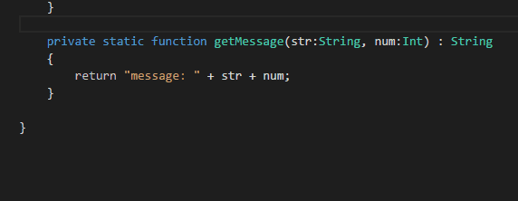
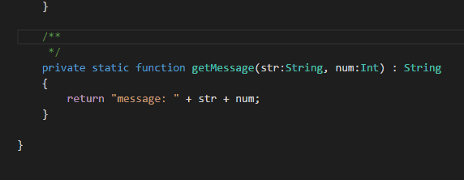
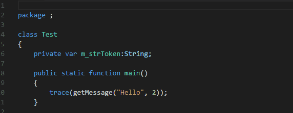

# Codedox for Haxe and Visual Studio Code

[](https://marketplace.visualstudio.com/items?itemName=wiggin77.codedox)

This is an extension for [Visual Studio Code](https://code.visualstudio.com) that helps developers document their [Haxe](http://haxe.org/) code. 

JSDoc style comments can be inserted including automatic generation of `@param` and `@return` tags.  File headers can be inserted with customizable copyright and license comments, or you can choose from a variety of built-in license texts.

This extension is best used as a companion to [vshaxe](https://marketplace.visualstudio.com/items?itemName=nadako.vshaxe) which provides Haxe support for Visual Studio Code.

## Usage

1. Type `/*` at top of file to insert a file header.
	* if no file header template has been configured then a simple setup wizard will ask a few questions and save the configuration
2. Position cursor before a function declaration and type `/**` to insert a JSDoc-style comment.
3. Position cursor before a variable or class declaration and type `/**` to get an empty JSDoc-style comment, then press `enter` immediately to get a multiline comment.

File header and JSDoc-style comments can also be inserted using commands. Invoke the commands using `F1` or `Ctrl-Shift-P`/`Cmd-Shift-P` and typing `Codedox: Insert ...`

## Features

### Insert JSDoc comment


### On-enter rules


### Insert file header


## Setup 'Wizard'

A basic configuration can be created using the simple setup 'wizard'. This is triggered when typing `/*` at the top of a file for the first time, or by running the setup command using `F1` or `Ctrl-Shift-P`/`Cmd-Shift-P` and typing `Codedox: Setup ...`.

The wizard will ask:

1. Where you want the configuration saved (user or workspace)
2. Which of the built-in license templates you want to use (if any)
	* GNU Affero General Public License
	* Apache License, Version 2.0
	* GNU General Public License, Version 3.0
	* MIT License
	* Mozilla Public License, Version 2.0
	* Simple copyright
3. A company/author name to include in your copyright.  

## Advanced Configuration

Most Codedox settings are optional, and all required settings can be generated by the setup wizard. If you want use a built-in license template or simple copyright then just run the setup wizard and skip this section.

If you want to create a custom license/copyright template or want to change how the comments look, then you can cut and paste the following into your user or workspace settings file (`.vscode/settings.json`) and customize as needed. A list of built-in parameters that can be used in your custom templates is also listed below.

```js
{
  "codedox": {
    "autoInsert": true, // Enables insertion of function comments trigged by keystrokes
    "autoInsertHeader": true, // Enables insertion of file header triggered by keystrokes
    "autoPrefixOnEnter": true, // Enables 'on enter' rules
	"paramFormat": "@param ${name} - ", // supports ${name} and ${type}, plus built-in params
	"returnFormat": "@return ${type}", // supports ${type}, plus built-in params
    "commentprefix": "*  ",
    "commentbegin": "/**",
    "commentend": "*/",
    "commentdescription": "[Description]",
    "headerprefix": " *",
    "headerbegin": "/*",
    "headerend": " */",
    "fileheader": {
      "params": {
        "*": {
          "company": "My Company",
          "author": "Wiggin"
        }
      },
      "templates": {
        "*": [
          "${headerbegin}",
          "${headerprefix} Copyright (c) ${year} ${company}",
          "${headerprefix}",
          "${headerprefix} Author: ${author}",
          "${headerend}"
        ]
      }
    }
  }
}
```
Built-in parameters:

Param         |  Result 
--------------|---------------------
${name}                  | variable name (function comments only)
${type}                  | variable or function type (function comments only)
${year}                  | 2017
${month}                 | 1
${day}                   | 2
${timestamp}             | 2017-01-02 15:17:40
${time24h}               | 15:17:40
${date}                  | 2017-01-02
${time}                  | 3:17:40 PM
${license_agpl_3_0}      | GNU Affero General Public License
${license_apache_2_0}    | Apache License, Version 2.0
${license_gpl_3_0}       | GNU General Public License, Version 3.0
${license_mit}           | MIT License
${license_mozillapl_2_0} | Mozilla Public License, Version 2.0
${license_none}          | Simple copyright

## Notes 
* If you do not want an asterisk preceding each line of a comment, replace the `commentprefix` property with two spaces (`"  "`). 
* If you prefer only one space before each line of a comment, replace `commentprefix` with asterisk plus one space (`"* "`). 
* Feature requests. comments, etc, are welcome.
